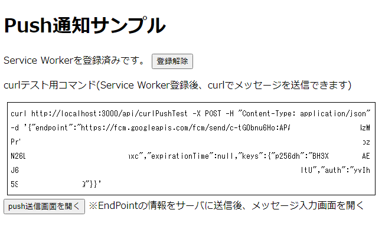
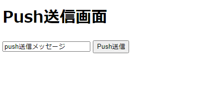

# Push通知サンプルプログラム


## はじめに

* ServiceWorkerを利用したPush通知を理解するためにサンプルプログラム
  * 簡単なサンプルを作るだけでもかなり苦労しました
  * ググった結果、Push通知自体の仕様と、Firebaseを利用するための固有の仕様は別物であるにもかかわらず、それが理解できなかったため
  * Firebaseを使わない(Push通知の仕組みのみ)サンプルです

## 概要

登場人物

1. ブラウザ
1. webサーバ

## Technology stack

* ブラウザ(JavaScript)

  * service Worker

* webサーバ(TypeScript)
  * TypeScript
  * ts-node
  * express
  * web-push


## 処理シーケンス


## 利用前の準備作業

VAPID用のキーペアを生成します。`vapidKey.json`というファイル名で保存されます。

```bash
npm run generateKey
```

## 実行手順

webサーバを起動します

```bash
npm run dev
```

`localhost:3000`をブラウザで開きます







