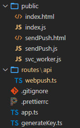
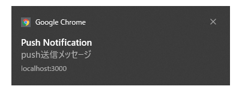

# VAPIDを使ったPush APIサンプルプログラム
## はじめに

世の中のサンプルがいまいち理解できなかったため、自分なりに書き下したサンプルです。

* ServiceWorkerを利用したPush通知サンプル
* Firebaseを使わないでPush通知を行うサンプルです([web-push](https://github.com/web-push-libs/web-push)を使います)

## 概要

1. webサーバ
    * 下記2つのhtmlを返します。
    * index.html
    * sendPush.html
    * Push通知を受け取り、EndPointに送信します。
1. index.html
    * ServiceWorkerを登録後、Push通知を購読します(EndPoint表示)

1. sendPush.html(Push送信メッセージ入力して、Webサーバに送信する)
    * PushメッセージWebサーバに送信　⇒ EndPointに送信　⇒ index.htmlのServiceWorkerに通知します。
## 構成



|  フォルダ | ファイル名  |  説明  |
| ---- | ---- | ---- |
| /   |  app.ts  | public配下のstaticファイルを返すWebサーバ(express)|
|    |  generateKey.ts  | VAPID用のキーペア`vapidKey.json`を生成するためのスクリプト(npm run generateKey) |
|   public |  index.html  | ServiceWorkerの登録を行い、Pushメッセージ受け取るための画面 |
|    |  index.js  | 〃 |
|    |  sendPush.html  | Push送信メッセージ入力して、Webサーバに送信するための画面|
|    |  sendPuth.js  | 〃 |
|    |  svc_worker.js  | Push受信を行うためのサービスワーカー|
|route/api| webpush.ts | index.htmlから受け取ったPush通知用EndPointの保存と、EndPointへのPush通知を行うApi(express) |


## Technology stack

* ブラウザ(JavaScript)
  * service Worker

* webサーバ(TypeScript)
  * TypeScript
  * ts-node
  * express
  * web-push


## 利用前の準備作業

VAPID用のキーペアを生成します。`vapidKey.json`というファイル名で保存されます。

```bash
npm run generateKey
```

## 処理シーケンス
1. サーバ側で鍵ペアを生成する(最初の1回のみ)
1. 以降は下記のシーケンスで動きます


## 実行手順

* webサーバを起動します

```bash
npm run dev
```

* `localhost:3000`をブラウザで開きます(index.html)


* `登録ボタン`を押下することで、サーバから公開キーの取得と、Pushサービスの購読を行います。

  （endpointを含む、PushSubscriptionを入手します)


* 画面にcurl用テストコマンドと、Push送信画面を開くボタンが表示されます。


* この画面でメッセージを入力して送信すると、通知が表示されます。




## 主要ソースの説明(ブラウザ側)

### index.html

```html
<!doctype html>
<html lang="ja">

<head>
  <meta charset="utf-8">
  <title>Push通知サンプル</title>
  <!-- Include manifest -->
  <!-- <link rel="manifest" href="manifest.json"> -->
</head>

<body>
  <h1>Push通知サンプル</h1>

  <div id="install-svcw" style="display:none;">
    Service Workerは登録されていません。
    <button id="install_svcworker">登録</button>
  </div>
  <div id="uninstall-svcw" style="display:none;">
    Service Workerを登録済みです。
    <button id="uninstall_svcworker">登録解除</button>

    <p>curlテスト用コマンド(curlでPush通知を送信できます)</p>
    <div style="word-break: break-all;border: 1px solid black;margin: 6px;padding:6px;">
      <code class="js-subscription-json"></code>
    </div>

    <div>
      <form action="/api/registEndpoint" method="post" target="_blank">
        <input type="hidden" name="endpoint" id="endpoint" />
        <button type="submit">push送信画面を開く</button>
        ※EndPointの情報をサーバに送信後、メッセージ入力画面を開く
      </form>
    </div>
  </div>
</body>

<script src="./index.js"></script>
</html>
```


### index.js
```js
window.addEventListener('load', async (event) => {
  // 各種イベントハンドラを登録
  // 「インストール」ボタンをクリック→registerServiceWorker()を実行
  document
    .getElementById('install_svcworker')
    .addEventListener('click', registerServiceWorker);

  // 「インストール」ボタンをクリック→unregisterServiceWorker()を実行
  document
    .getElementById('uninstall_svcworker')
    .addEventListener('click', unregisterServiceWorker);

  // ページロード時にService Workerの登録状況をチェックする
  await checkServiceWorkerRegistered();
});

/**
 * 公開鍵(base64)をUint8Arrayに変換する(subscribeの引数用)
 * @param {*} base64String
 * @returns
 */
const urlB64ToUint8Array = (base64String) => {
  const padding = '='.repeat((4 - (base64String.length % 4)) % 4);
  const base64 = (base64String + padding)
    .replace(/\-/g, '+')
    .replace(/_/g, '/');

  const rawData = window.atob(base64);
  const outputArray = new Uint8Array(rawData.length);

  for (let i = 0; i < rawData.length; ++i) {
    outputArray[i] = rawData.charCodeAt(i);
  }
  return outputArray;
};

/**
 * Service Workerを登録する
 */
const registerServiceWorker = async () => {
  if ('serviceWorker' in navigator) {
    try {
      const swReg = await navigator.serviceWorker.register('./svc_worker.js');
      console.log('Service Worder is registerd', swReg);

      // サーバから公開キーを取得
      const vapidPublicKey = await (await fetch('/api/vapidPublicKey')).text();

      const options = {
        userVisibleOnly: true,
        applicationServerKey: urlB64ToUint8Array(vapidPublicKey),
      };

      // Push通知を購読する
      const reg = await navigator.serviceWorker.ready;
      await reg.pushManager.subscribe(options);

      // Push通知表示を許可するための確認を表示
      Notification.requestPermission((permission) => {
        console.log(permission); // 'default', 'granted', 'denied'
      });

      // ServiceWorkerの状態を画面に表示する
      await checkServiceWorkerRegistered();
    } catch (err) {
      console.log(`Service Worker registration failed: ${err}`);
      await checkServiceWorkerRegistered();
    }
  }
};

/**
 * Service Workerの登録を解除する
 */
const unregisterServiceWorker = async () => {
  if ('serviceWorker' in navigator) {
    try {
      const swReg = await navigator.serviceWorker.getRegistration();
      const subscription = await swReg.pushManager.getSubscription();
      if (subscription) {
        await subscription.unsubscribe();
      }
      await swReg.unregister();

      await checkServiceWorkerRegistered();
    } catch (err) {
      console.log(err);
    }
  }
};

/**
 * Servie Workerが登録されているかチェック
 * 「登録」「登録解除」ボタンを切り替える
 */
const checkServiceWorkerRegistered = async () => {
  // Servie Workerが登録されているかチェックする
  const swReg = await navigator.serviceWorker.getRegistration();

  const elInst = document.getElementById('install-svcw');
  const elUninst = document.getElementById('uninstall-svcw');
  if (swReg) {
    // 登録されている場合、登録解除ボタンを表示する
    elUninst.removeAttribute('style');
    elInst.setAttribute('style', 'display:none;');

    // Push通知を購読しているか確認する
    const subscription = await swReg.pushManager.getSubscription();
    if (subscription) {
      // 購読している場合、curlでPush通知の疎通確認をするコマンドを表示する
      const jsonSub = JSON.stringify(subscription);
      const cmdArea = document.querySelector('.js-subscription-json');
      cmdArea.textContent = `curl http://localhost:3000/api/curlPushTest -X POST -H "Content-Type: application/json" -d '${jsonSub}'`;

      // push送信画面用にEndPointをセットする。
      //  ⇒Push送信画面を開く際、endpointをサーバに送信する。
      //    サーバはendpointを保存し、そこへPush通知を行う。
      const hidden = document.getElementById('endpoint');
      hidden.value = jsonSub;
    }
  } else {
    // 登録されていない場合、登録ボタンを表示する
    elInst.removeAttribute('style');
    elUninst.setAttribute('style', 'display:none;');
  }
};

```

### svc_worker.js
```js
// pushイベントハンドラを登録
self.addEventListener('push', (event) => {
  // 通知設定が行われているかをチェック
  if (!self.Notification || self.Notification.permission !== 'granted') {
    // 通知設定が行われていなければ何もせず終了
    return;
  }

  // 送信されたデータを取得
  if (event.data) {
    const data = event.data.text();
    console.log(data);

    event.waitUntil(
      self.registration.showNotification('Push Notification', {
        body: data,
      }),
    );
  }
});

// 表示された通知をクリックされた場合に発生するイベント
self.addEventListener('notificationclick', function (event) {
  console.log('[Service Worker] Notification click Received.');

  event.notification.close();
});

```


### sendPush.html

```html
<!doctype html>
<html lang="ja">

<head>
  <meta charset="utf-8">
  <title>Push送信画面</title>
</head>

<body>
  <h1>Push送信画面</h1>
  <form >
    <input type="text" name="message" id="message" value="push送信メッセージ" />
    <button type="button" id="pushButton">Push送信</button>
  </form>
</body>

<script src="./sendPush.js"></script>
</html>
```

```js
window.addEventListener('load', async (event) => {
  document
    .getElementById('pushButton')
    .addEventListener('click', sendPushMessage);
});

/**
 * Push通知送信ボタン
 *   /api/sendMessage にメッセージを送信する
 * @param {*} event
 */
const sendPushMessage = async (event) => {
  event.preventDefault();
  const message = document.getElementById('message').value;

  // FetchAPIのオプション準備
  const param = {
    method: 'POST',
    headers: {
      'Content-Type': 'application/json; charset=utf-8',
    },

    // リクエストボディ
    body: JSON.stringify({ message }),
  };

  await (await fetch('/api/sendMessage', param)).text();
};
```


## 主要ソース(サーバ側)

### route/api/webpush.ts

```typescript
import express from 'express';
import webPush from 'web-push';
import vapidKey from '../../vapidKey.json'; // generateKey.tsで生成したキーペア

var router = express.Router();

webPush.setVapidDetails(
  'mailto:hoge@example.com',
  vapidKey.publicKey,
  vapidKey.privateKey,
);

/**
 * ブラウザにキーを公開するためのメソッド
 * (必ずしもapiで公開する必要はない。手順簡略化のため)
 */
router.get('/vapidPublicKey', async (req, res, next) => {
  return res.send(vapidKey.publicKey);
});

/**
 * curlからのPush送信テスト用Api
 *  ・curlからendpointを受け取りpush通知を行う(送信メッセージは固定)
 */
router.post('/curlPushTest', async (req, res, next) => {
  console.log(req.body);

  try {
    const response = await webPush.sendNotification(
      req.body,
      'Web Push通知テスト',
    );

    return res.json({
      statusCode: response.statusCode || -1,
    });
  } catch (err) {
    console.log(err);
    return res.status(500).send(err);
  }
});

// endPoint保存用(Push通知送信先)
let endPoint: string = '';

/**
 * endPointをサーバに保存後するApi
 * (保存後、送信画面へリダイレクト)
 */
router.post('/registEndpoint', async (req, res, next) => {
  console.log(req.body);
  endPoint = req.body['endpoint'];
  res.redirect('/sendPush.html');
});

/**
 * 登録されたendpointへメッセージを送信するApi
 * sendPush.jsから呼び出される
 */
router.post('/sendMessage', async (req, res, next) => {
  console.log(endPoint);
  try {
    const response = await webPush.sendNotification(
      JSON.parse(endPoint),
      req.body['message'],
    );

    return res.json({
      statusCode: response.statusCode || -1,
    });
  } catch (err) {
    console.log(err);
    return res.status(500).send(err);
  }
});

module.exports = router;
export default router;
```

### app.ts

```typescript
import express from 'express';
import path from 'path';
import cookieParser from 'cookie-parser';
import logger from 'morgan';

import webpushRouter from './routes/api/webpush';

var app = express();

app.use(logger('dev'));
app.use(express.json());
app.use(express.urlencoded({ extended: false }));
app.use(cookieParser());
app.use(express.static(path.join(__dirname, 'public')));

app.use('/api', webpushRouter);

// importでもrequire()でも読み込めるように2種類export
module.exports = app;
export default app;
```

## その他ソース(キー生成)

### generateKey.ts
```typescript
import webpush from 'web-push';
console.log(JSON.stringify(webpush.generateVAPIDKeys()));
// '{"publicKey":"BFK...GNY","privateKey":"g0y...7jY"}'
```
