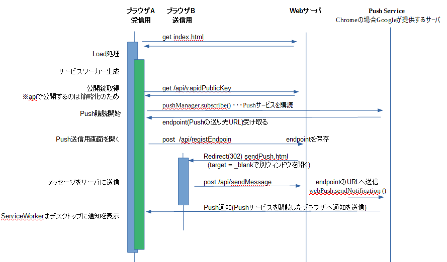
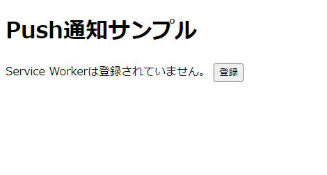

# VAPIDを使ったPush APIサンプルプログラム
## はじめに

* ServiceWorkerを利用したPush通知を理解するためにサンプルプログラム
  * 簡単なサンプルを作るだけでもかなり苦労しました
  * ググった結果、Push通知自体の仕様と、Firebaseを利用するための固有の仕様は別物であるにもかかわらず、それが理解できなかったため
  * Firebaseを使わないでPush通知を行うサンプルです([web-push](https://github.com/web-push-libs/web-push)を使います)

## 概要


1. webサーバ
    * 下記2つのhtmlを返します。
    * index.htmlからEndPointを受け取り保存後
    * sendPush.htmlから受け取ったメッセージをindex.htmlのServiceWorkerに通知します。
1. index.html(ServiceWorkerの登録を行い、Pushメッセージ受け取る。)

1. sendPush.html(Push送信メッセージ入力して、Webサーバに送信する)

## 構成


|  フォルダ | ファイル名  |  説明  |
| ---- | ---- | ---- |
| /   |  app.ts  | public配下のstaticファイルを返すWebサーバ(express)|
|    |  generateKey.ts  | VAPID用のキーペア`vapidKey.json`を生成するためのスクリプト(npm run generateKey) |
|   public |  index.html  | ServiceWorkerの登録を行い、Pushメッセージ受け取るための画面 |
|    |  index.js  | 〃 |
|    |  sendPush.html  | Push送信メッセージ入力して、Webサーバに送信するための画面|
|    |  sendPuth.js  | 〃 |
|    |  svc_worker.js  | Push受信を行うためのサービスワーカー|
|route/api| webpush.ts | index.htmlから受け取ったPush通知用EndPointの保存と、EndPointへのPush通知を行うApi(express) |


## Technology stack

* ブラウザ(JavaScript)
  * service Worker

* webサーバ(TypeScript)
  * TypeScript
  * ts-node
  * express
  * web-push


## 利用前の準備作業

VAPID用のキーペアを生成します。`vapidKey.json`というファイル名で保存されます。

```bash
npm run generateKey
```

## 処理シーケンス
1. サーバ側で鍵ペアを生成する(最初の1回のみ)
1. 以降は下記のシーケンスで動きます


## 実行手順

* webサーバを起動します

```bash
npm run dev
```

* `localhost:3000`をブラウザで開きます(index.html)



* `登録ボタン`を押下することで、サーバから公開キーの取得と、Pushサービスの購読を行います。

  （endpointを含む、PushSubscriptionを入手します)


* 画面にcurl用テストコマンドと、Push送信画面を開くボタンが表示されます。


* この画面でメッセージを入力して送信すると、通知が表示されます。


